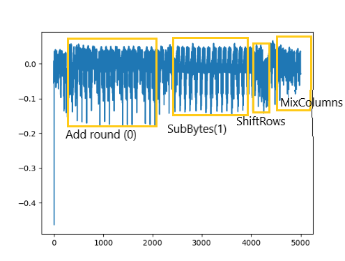

#DPA Attack on AES
This repository implements a practical demonstration of a side channel attack, specifically the Differential Power Analysis (DPA) attack against the Advanced Encryption Standard (AES) cipher. 
## Analysis of a Trace

On a trace such as this one (which represents the first AES round), we can observe the different operations of the round (AddRound, SubBytes, ShiftRows, MixColumns) thanks to the change in the consumption pattern.
